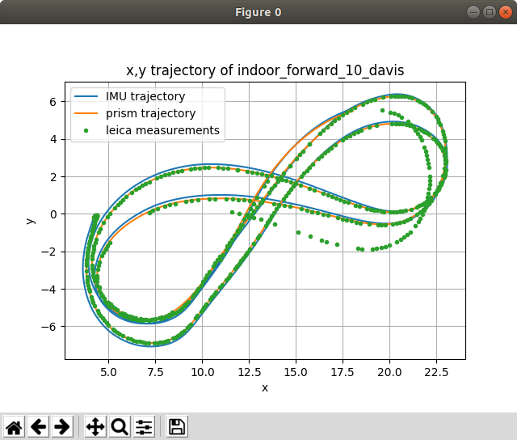
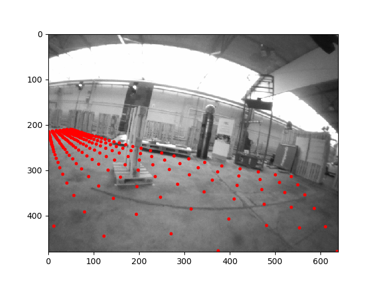

# uzh_fpv_open


This is additional code that we release under the GPL-3.0 license to accompany [the UZH FPV dataset](https://fpv.ifi.uzh.ch/).
It has the following main features:

* [Code to read the raw Leica measurements](python/uzh_fpv/leica.py).
* Code to assess the quality of the provided ground truth (see below for instructions):
  * By matching the predicted gyro output to the actual gyro output, as proposed [in this issue by Vladyslav Usenko](https://github.com/uzh-rpg/IROS2019-FPV-VIO-Competition/issues/6).
  * By matching the predicted position of the prism to Leica measurements.
  * By projecting virtual points into the camera frame to qualitatively assess the rotation estimates.
* As a serendipitous byproduct, [an implementation of a time-differentiable continuous trajectory representation](python/uzh_fpv/bspline_opt.py), see the **[quick tutorial](spline_tutorial.md)**.

This repository does **not** contain the code that was used to generate the ground truth.

# Table of Contents

1. [Citing](#citing)
2. [Installation](#installation)
3. [Usage](#usage)
   * [Detailed instructions](#detailed-instructions)
      * [Evaluating the error between ground truth and Leica measurements](gt_to_leica_error.md)
      * [Rotation sanity check using projected virtual points](#Rotation-sanity-check-using-projected-virtual-points)
   * [Overview of other scripts](#overview-of-other-scripts)
4. [Acknowledgements](#acknowledgements)

# Citing

Please cite the dataset paper when using the code in this repository:
```bibtex
@InProceedings{Delmerico19icra,
 author        = {Jeffrey Delmerico and Titus Cieslewski and Henri Rebecq and
                  Matthias Faessler and Davide Scaramuzza},
 title         = {Are We Ready for Autonomous Drone Racing? The {UZH-FPV} Drone
                  Racing Dataset},
 booktitle     = {{IEEE} Int. Conf. Robot. Autom. ({ICRA})},
 year          = 2019
}
```
To achieve the matching of ground truth to Leica measurements, this repository contains [an implementation of a time-differentiable continuous trajectory representation](python/uzh_fpv/bspline_opt.py) based on the following publication:
```bibtex
@InProceedings{Mueggler15rss,
 author      = {Elias Mueggler and Guillermo Gallego and Davide Scaramuzza},
 title       = {Continuous-Time Trajectory Estimation for Event-based Vision
               Sensors},
 booktitle   = {Robotics: Science and Systems ({RSS})},
 year        = 2015,
 doi         = {10.15607/RSS.2015.XI.036}
}
``` 
It allows to solve optimization problems that include both the trajectory shape and a time offset on trajectory sampling times.
For optimization, we use [Casadi](https://web.casadi.org/).
```bibtex
@Article{Andersson2019,
 author = {Joel A E Andersson and Joris Gillis and Greg Horn
           and James B Rawlings and Moritz Diehl},
 title = {{CasADi} -- {A} software framework for nonlinear optimization
           and optimal control},
 journal = {Mathematical Programming Computation},
 volume = {11},
 number = {1},
 pages = {1--36},
 year = {2019},
 publisher = {Springer},
 doi = {10.1007/s12532-018-0139-4}
}
```

# Installation

Assuming you have [ROS Melodic installed](http://wiki.ros.org/melodic/Installation) on Ubuntu 18.04:
```bash
sudo apt install python-catkin-tools

mkdir -p uzh_fpv_ws/src
cd uzh_fpv_ws
catkin config --init --mkdirs --extend /opt/ros/melodic --merge-devel --cmake-args -DCMAKE_BUILD_TYPE=Release

cd src
git clone git@github.com:catkin/catkin_simple.git
# RPG: uzh_fpv here and below for our internal version.
git clone git@github.com:uzh-rpg/uzh_fpv_open.git
cd uzh_fpv_open
pip install -r requirements.txt

catkin build
```

To interact with the dataset, you will need to add the following folders to the root of the repository.
Note that you can use softlinks (`ln -s /actual/location .`):

| Folder | Description |
|-------|--------| 
| calib | Contains the unzipped calibration files. |
| raw | Contains raw data: unzipped "Leica" folder from the [public dataset](https://fpv.ifi.uzh.ch/?page_id=50) or the `raw` folder from the internal dataset. |
| output | Contains the bags (not zips) from the public dataset, or the contents of `v2` (or later) from the internal dataset. |

# Usage

Flags defined in [python/uzh_fpv/flags.py](python/uzh_fpv/flags.py) are used to specify which sequence you want to work with. For example, to use `indoor_45_2_snapdragon`, you would use flags `--env=i --cam=45 --nr=2 --sens=snap`.
Graphical output can in most scripts be suppressed with `--nogui`.

## Detailed instructions

### Evaluating the error between ground truth and Leica measurements



See the full instructions [here](gt_to_leica_error.md).

### Rotation sanity check using projected virtual points



` python scripts/render_gt_projection.py `

Rendered images are output in `plots/SEQUENCE_STRING/gt_projection`.

Per default, the ground truth trajectory is used for rendering. It can be replaced with an estimate according to this specification by adding a flag `--estim=PATH_TO_TXT_FILE`. In that case, the rendering is output to `plots/SEQUENCE_STRING/es_projection`.

These outputs can be converted into an mp4 video with the following command:

```
ffmpeg -r 30 -i %06d.png -c:v libx264 -vf fps=25 -pix_fmt yuv420p out.mp4
```

## Overview of other scripts

Found in the scripts folder. Can be categorized as follows:

### Preprocessing

`make_min_imu_gto_bag.py`: Create a `min_bag` containing only imu and ground truth, for faster processing in other scripts.

### Dataset inspection

`compare_gyro.py` (as proposed [in this issue by Vladyslav Usenko](https://github.com/uzh-rpg/IROS2019-FPV-VIO-Competition/issues/6)), `plot_leica.py`, `plot_leica_vs_gt.py`, `match_davis_to_snapdragon_gt.py`(matches davis to snapdragon groundtruth according to a provided time-offset)

### Dataset publishing

`batch_check_ground_truths.py`, `batch_degroundtruth.py` (create bags and zips without ground truths, for datasets where ground truth is withheld), `print_files_to_publish.py` (list of files to be published, to verify contents of the public directory)

## Acknowledgements

The authors would like to thank Stefan Gächter, Zoltan Török, and Thomas Mörwald of Leica Geosystems for their
support in gathering our data, and Innovation Park Zürich and the Fässler family for providing experimental space.
Additional thanks go to iniVation AG and Prof. Tobi Delbruck for their support and guidance with the mDAVIS sensors, 
and to Francisco Javier Pérez Grau for his help in the evaluation. 

We would also like to thank Vladyslav Usenko from the Computer Vision Group at TU Munich and Patrick Geneva from the
Robot Perception and Navigation Group at the University of Delaware for their feedback on the dataset. Finally, we would like to thank our colleague Zichao Zhang from the Robotics and Perception Group for his help in the competitions that are associated with the datasets, as well as his feedback during the development of this code.

This work was supported by the National Centre of Competence inResearch Robotics (NCCR) through the Swiss National 
Science Foundation,the SNSF-ERC Starting Grant, and the DARPA Fast Lightweight Autonomy Program.
